# HW5 实验报告

2015011313 徐鉴劲 计54

## 备注

我没有在集群上完成实验，在别的服务器上完成的实验。

因为集群上面的环境总是配不好，如果代码在集群上运行出现了问题，希望助教能够及时联系我，谢谢！

集群的路径是：/home/2015011313/hw5。

运行`./make.sh`就可以编译所有代码了。

## 第一题：矩阵乘法并行化性能分析

题目描述：N x N 的矩阵和 N 长度的向量相乘，对比：

1. 并行化算法与串行算法的 a. 执行时间 b. 加速比 c. 效率

2. 通过 L2 Norm 来判断并行化结果的计算是否正确

3. 通过并行化方法计算 L2 Norm，并统计执行时间。

### 算法设计

#### 矩阵相乘的并行化

基本上采用了HW3中给出的参考代码。
主要更改了输入输出，使得串行算法和并行算法在同一个矩阵和向量上进行测试。

#### L2 Norm的并行化

串行计算方法就是将两个向量中每一个元素的平方差都累加起来，并行计算就是将两个向量都分配到计算节点上（MPI_Scatter），计算完成以后通过MPI_Reduce汇聚到根节点。

### 实验结果

通过运行：

```
./make.sh
python script/run.py
```

可以复现得到下面的结果。

我在 N = 4000, 8000, 12000, 16000, 20000, 32000, 44000 与核心数目 p = 4, 10, 20, 40的组合条件下分别进行了5次重复实验，得到下面的性能测试结果。

#### 执行时间

|和串行的比较|不同计算节点数目之间的比较|
|:---|:---|
|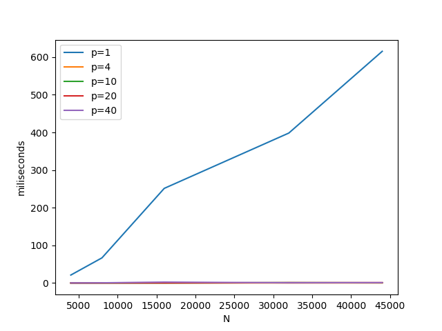|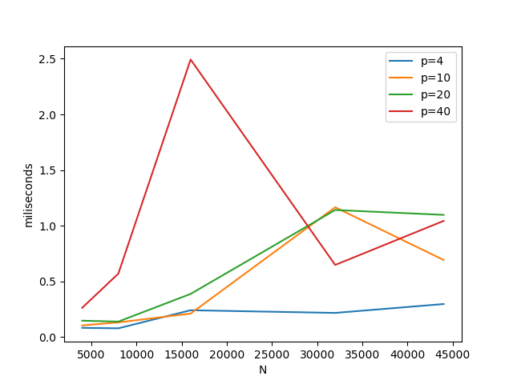|

从与串行程序的比较可以看出明显的加速。

从不同计算节点数目之间的比较可以看出计算核心越多，计算速度就越快。

但是核心数多了也并不一定好。在我进行实验的时候，系统中也有别的用户占用计算资源，进程数过多就会导致有一些进程被放入等待队列中，导致计算效率反而下降了。

#### 加速比例

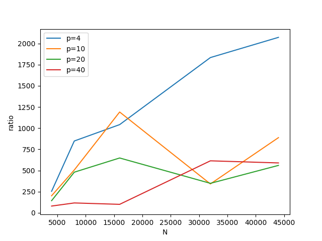

20个核心的时候达到了最大加速比例。

加速比中在N=16000的时候普遍出现了一个尖峰，这可能是由于系统中其他因素导致的，比如说多线程恰好将cache利用好了。

#### 效率

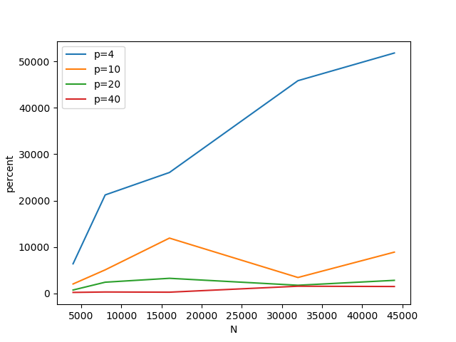

可以看出，随着计算节点的增多，效率实际上是下降的。随着任务规模的增大，效率也有着微弱的下降，说明并行化并不是理想的。

但是效率中在N=16000的时候普遍出现了一个效率尖峰，甚至导致效率超过100%，这可能是由于系统中其他因素导致的，比如说多线程恰好将cache利用好了。

4个核心的时候达到了最大效率。

#### L2 Norm 的耗时


如上图所示，计算L2占用的时间很少。

## 第二题：多线程链表操作问题

问题描述：使用Pthread对一个链表进行操作。如果不加任何的读写锁，那么多线程的时候就会出现下列问题：

1. 两个线程同时删除操作的时候发生错误的情况可以分为：

* 如果它们将要删除同一个元素：一个线程完成了删除与恢复链接的过程后，另一个线程开始删除，那么会出现找不到元素的情况。

* 如果它们删除的是不同的元素：一个线程首先把靠近队首的节点首先被删除了，然后另一个线程在遍历链表，前往位置靠后的节点，就会在中途有访问到非法内存。

2. Insert和Delete同时进行：

* 如果Insert正好插入在Delete要删除的节点之后：Delete中途进行Insert，Insert由于访问前一个节点会产生非法访问。

* 如果Insert正好插入在Delete将要删除的节点之前：插入节点之前的next指针可能会出现竞争，可能指向insert的节点，也可能被delete函数链接到insert之后的节点。

3. Member 和 Delete同时执行。

* Member访问Delete的节点或者其后的节点：如果在Delete操作还没有彻底完成的时候就进行了访问或者遍历，那么就会出现非法内存访问。

4. 两个Insert同时执行。

* 如果两个Insert要插入的节点在同一个节点之后：则前面的这一个节点的next指针存在竞争，它只会指向一个节点，两个Insert其中之一的节点将会失去联系，变成一个孤立的点。

5. Member和Insert同时执行

* 如果Insert的元素恰好是Member所要找的，那么可能会找不到。

### 解题思路

首先实现了一个简单的链表，然后直接使用粗粒度的锁进行保护。在所有操作的前面都加上一个有互斥锁保护的临界区。经过随机测试代码是正确的。

随机产生了4类操作：插入、删除、查询、打印。

从命令行输入实验的线程数量和数据规模就可以进行测试了。

运行代码：

```
build/prob2 <num_threads> <N>
```

代码见prob2.c。


## 第三题：trapezoidal问题

题目描述：使用课本上提供的代码，将临界区改到计算函数内部，研究性能的变化。

### 实验结果

直接按照提示将课本上的代码替换到相关位置，然后加上一个计时代码就可以了。

我选取的测试样例是：

-1 1 2560000

在两个线程的时候耗时：0.309944。

在一个线程的时候耗时：0.008466。

在N比较大的情况下，都会出现多线程反而慢的情况。

这是因为更改后的代码临界区的设置很不科学，经常进入临界区，导致线程的计算效率低下。

然后题目问给出的另外的一个程序是否有这样的问题。官网上给出了两个程序，分别是omp_trap_2a.c和omp_trap_2b.c，他们分别是临界区和reduction的写法。

经过试验，他们并没有这种问题。

汇总实验结果如下：

|时间|更改后的代码|trap_a|trap_b|
|:--|:--|:--|:--|
|线程数=1|0.008466|0.016922|0.009974|
|线程数=2|0.309944|0.015395|0.005215|

不过方法a略微差于方法b，因为后者使用的是OMP自带的reduction，实现得更好一些。

## 第四题：Schedule方法比较

这道题目要求使用OpenMP static schedule，OpenMP dynamic schedule和Pthread task queue完成一个矩阵随机求和的问题，并比较每一种方法的性能。

### 解题思路

简单起见，我使用多次重复实验的执行时间作为比较指标。将他们和串行的程序进行比较。

OpenMP的实现方法就是在串行的程序上加上parallel for，将对应的一些关键变量设置成private。程序内部甚至不存在临界区。
使用静态调度就是schedule(static, 1024)，动态调度就是schedule(dynamic, 1024)。

Pthread中实现的是非常简单的任务队列：用一个整数表示下一个未完成的任务是什么。每一个进程都处于一个无限循环的状态中，如果任务没有完成，就进入临界区，获取下一个任务，然后进行运算。任务完成就退出。

代码在src/prob3.c中，分别与串行程序进行了时间和正确性的比较。

### 实验结果

运行代码：

`python script/run_prob4.py`

1. 和串行算法的比较

|p=4|p=10|p=20|p=40|
|:--|:--|:--|:--|
|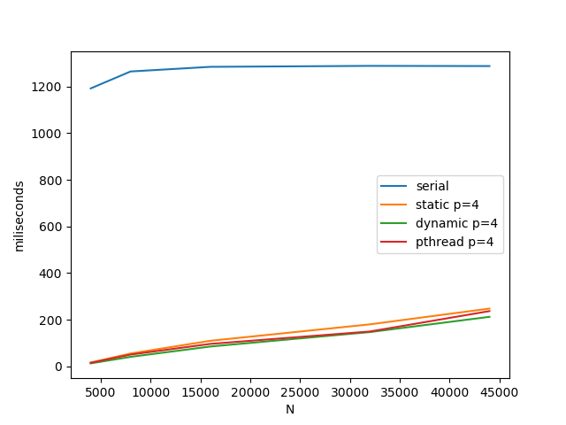|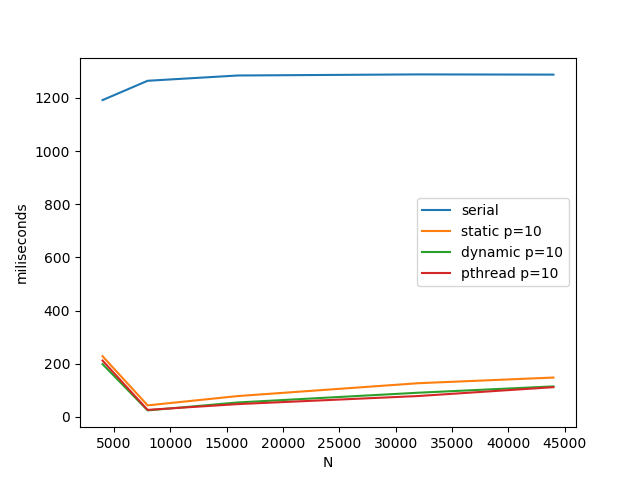|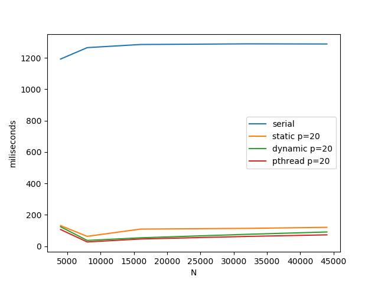|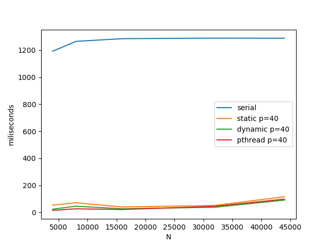|

所有算法都比并行算法提高了一大步。

2. 算法之间的详细比较

|p=4|p=10|p=20|p=40|
|:--|:--|:--|:--|
|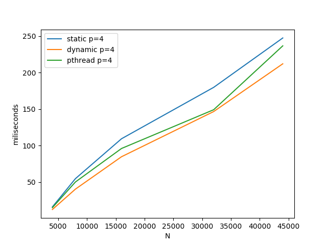|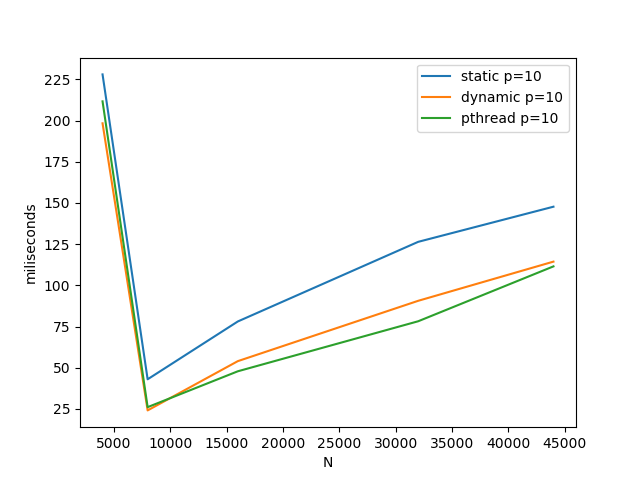|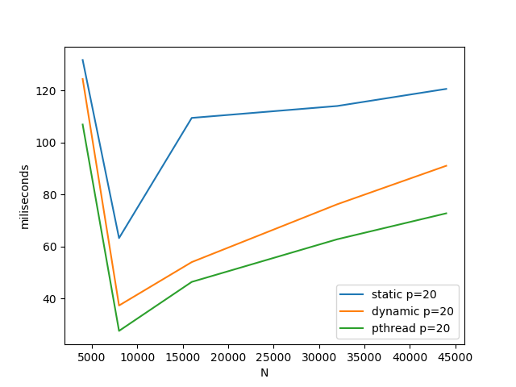|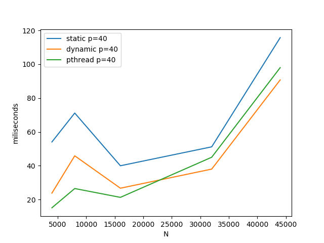|

除了任务规模比较小的时候出现了时间消耗偏大的情况，其余的时候增加线程个数都能继续提升能力。

static的效果是最差的，dynamic的效果是最好的，pthread次之。因为后面两个使用的是动态调度的算法，而前面是固定的，在世纪运行过程中很容易出现分配不均匀的情况。